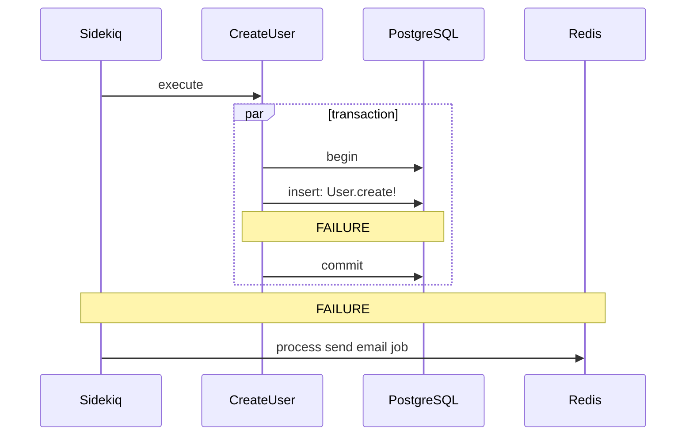
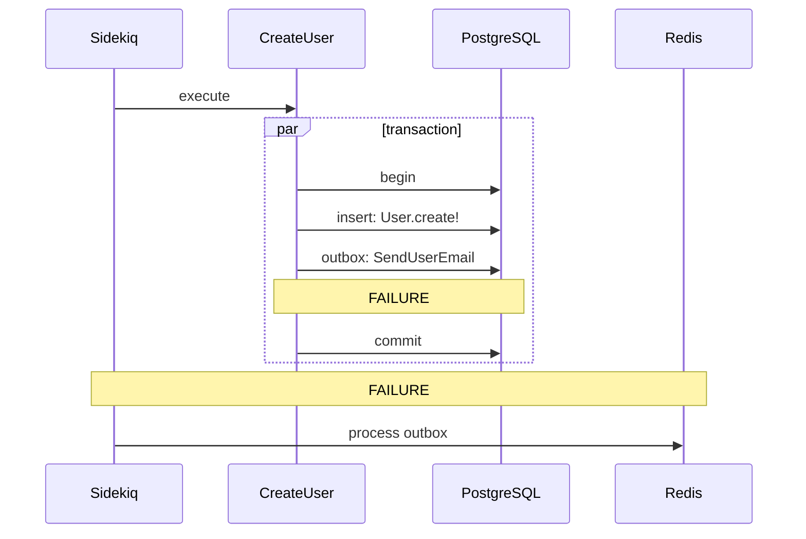
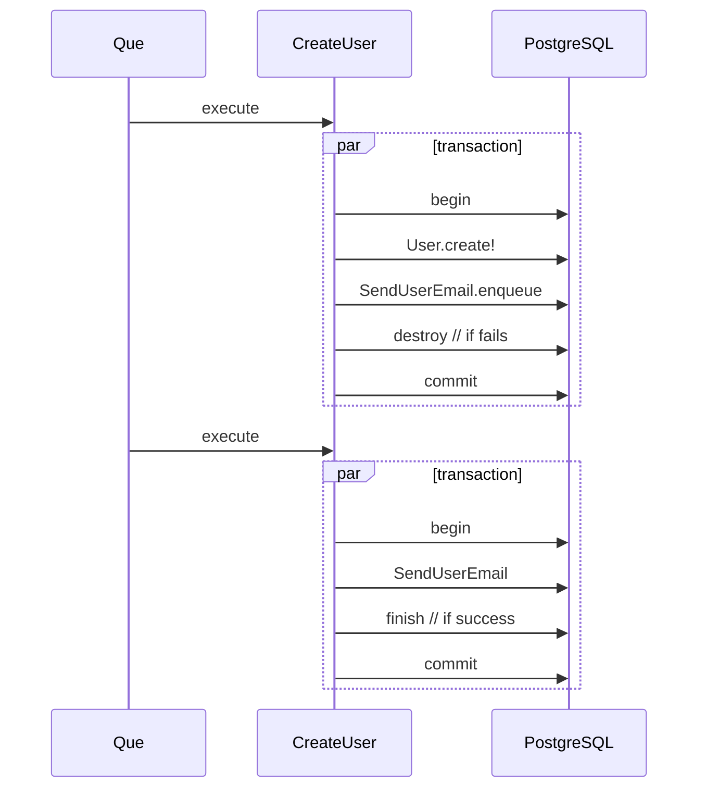
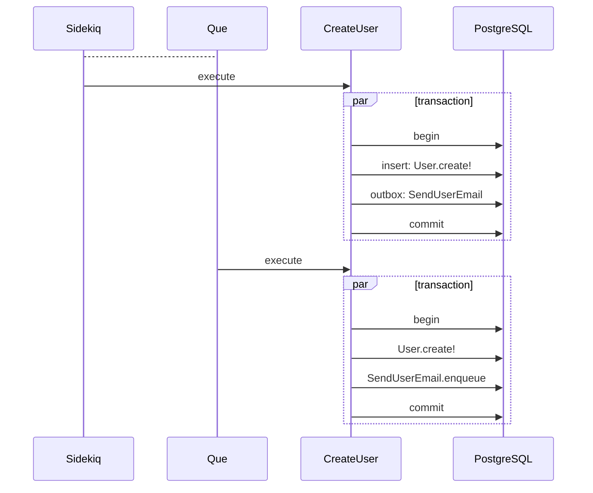
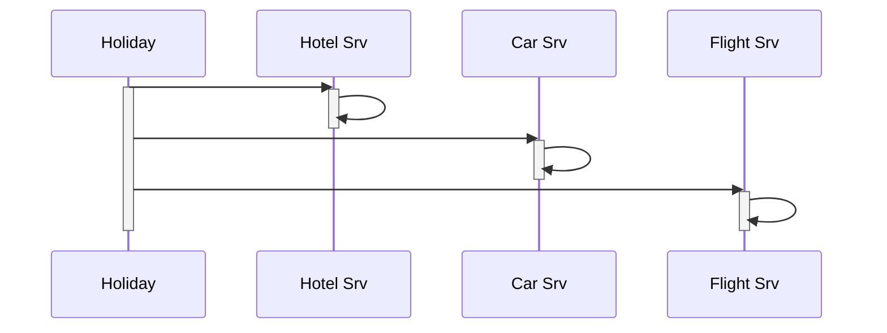
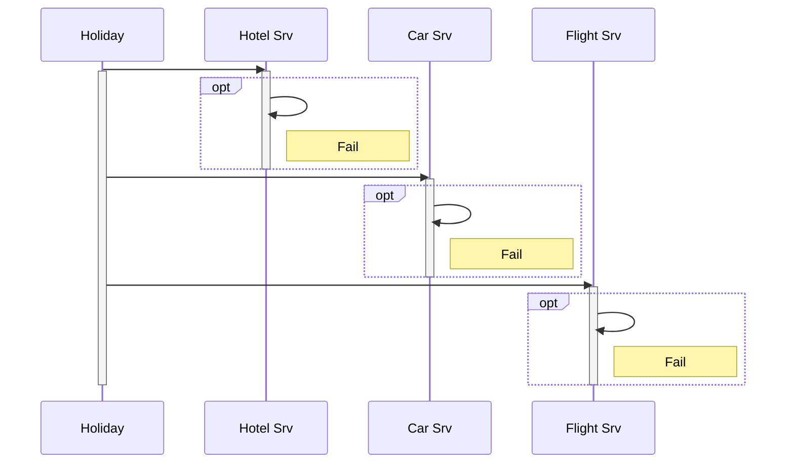
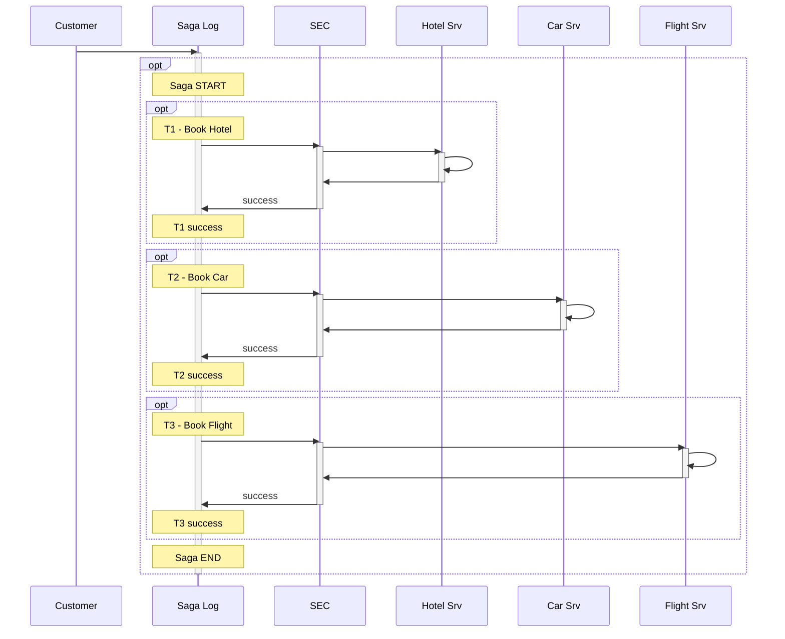
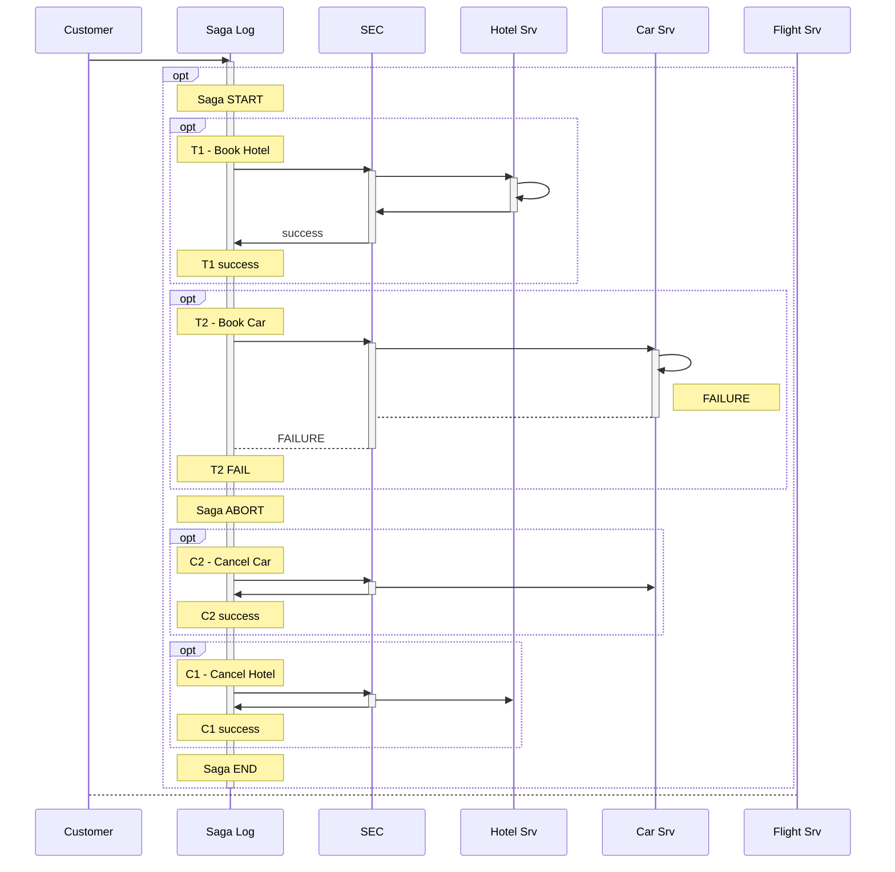

# Exeprimental Methods in Sidekiq

How I go about understanding things through experimentation

Michael Milewski
@saramic github/twitter
https://failure-driven.com

---

## Public Git

1. I want version control
1. I want to share
1. "Reporoduceable event stream as commit messages"

**DEMO**

```bash
open https://github.com/failure-driven/experimental-methods-in-sidekiq/commits/main
```

_press CTRL-e to execute_

---

## Start with a Makefile

1. Always available
1. Steps to install, run, demo, cleanup, reset, etc
1. It's a 3rd of the "3 Musketeers" pattern
    - https://3musketeers.io/guide/make.html

**DEMO**

```bash
make
```

---

## Sidekiq

1. ability to run background jobs
1. next best thing after Rails and a DB

**DEMO**

---

## Basic example

in request a **User** is created and in an asynchronous job an **email is
sent**

```ruby
User.create!(name: "mike")
EmailSend.create!(user_id: ...)
```

---

## In a sidekiq job

```ruby
module Sidekiq...
  def perform(name)
    user = nil
    User.transaction do
      user = User.create!(name: name)
      ...
    end

    SendEmailJob.perform_async(user.id)
  end
end
```

---

## Failures can occur

```ruby
module Sidekiq...
  def perform(name)
    user = nil
    User.transaction do
      user = User.create!(name: name)
      **FAILURE**
      ...
    end

    **FAILURE**
    SendEmailJob.perform_async(user_id: user.id)
  end
end
```

---

## Or in a state diagram

https://github.com/failure-driven/experimental-methods-in-sidekiq/blob/main/PRESENTATION.md#or-in-a-state-diagram



---

## Demo sidekiq

```
make demo-sidekiq

make create-user name=mike

# fail_job_1: "PART 1 killer"
make create-user name=kevin

# fail_job_2: "die in part 2"
make create-user name=matt
```

---

## Transactional Outbox

- we have a **Dual Write** problem
  - https://developers.redhat.com/articles/2021/07/30/avoiding-dual-writes-event-driven-applications
  - https://thorben-janssen.com/dual-writes/
  - 2 data stores: PostgreSQL and Redis
- what if we stored everything in PostgreSQL?

---

## Transactional Outbox - sequence

https://github.com/failure-driven/experimental-methods-in-sidekiq/blob/main/PRESENTATION.md#transactional-outbox-sequence



---

## Demo outbox

```
make demo-sidekiq

make outbox-create-user name=mike

# fail_job_1: "PART 1 killer"
make outbox-create-user name=kevin

# fail_job_2: "die in part 2"
make outbox-create-user name=matt
```

---

## Enter Que

* https://github.com/que-rb/que
* Que ("keɪ", or "kay") is a queue for Ruby and PostgreSQL
  - _that manages jobs using [advisory locks](http://www.postgresql.org/docs/current/static/explicit-locking.html#ADVISORY-LOCKS)_

https://github.com/failure-driven/experimental-methods-in-sidekiq/blob/main/PRESENTATION.md#enter-que



---

## Demo Que

```
make demo-que

make create-user name=mike

# fail_job_1: "PART 1 killer"
make create-user name=kevin

# fail_job_2: "die in part 2"
make create-user name=matt
```

---

## Que looks like Transactional Outbox

https://github.com/failure-driven/experimental-methods-in-sidekiq/blob/main/PRESENTATION.md#que-looks-like-transactional-outbox



---

## What is the saga pattern?

```html
<h1>
  "A Saga is a Long Lived Transaction that
  <br/>can be written as a sequence of
  <br/>transactions that can be interleaved."
</h1>
<h1>
  "All transactions in the sequence complete
  <br/>successfully or compensating transactions
  <br/>are ran to amend a partial execution."
</h1>
```

---

## What has Saga pattern to do with Sidekiq/Que?

- nothing really
- same ballpark - multiple data stores
- distributed transactions
- imagine that we are doing more than creating user and sending email
- say we have a travel app

https://github.com/failure-driven/experimental-methods-in-sidekiq/blob/main/PRESENTATION.md#what-has-saga-pattern-to-do-with-sidekiqque



---

## Each Service could fail

https://github.com/failure-driven/experimental-methods-in-sidekiq/blob/main/PRESENTATION.md#each-service-could-fail



---

## Enter Saga pattern

https://github.com/failure-driven/experimental-methods-in-sidekiq/blob/main/PRESENTATION.md#enter-saga-pattern



---

## How does Saga deal with failure

https://github.com/failure-driven/experimental-methods-in-sidekiq/blob/main/PRESENTATION.md#how-does-saga-deal-with-failure



---

## Saga demo?

- _not this time_

---

## What do Saga's provide?

- **C**onsistency and **D**urability
- NOT **A**tomicity and **I**solation

---

## Some rules

- Saga's "sub transactions"
  - cannot depend on each other
  - cannot depend on ordering
  - each "sub transaction" needs a "compensating transaction"
  - **Cn** semantically undoes **Tn**
    - ie an email cannot be unsent but a follow up email may be OK

---

## Failure recovery

- **Backward Recovery**
  - most common
  - once a service fails - roll back
- **Forward Recovery**
  - also an option
- **Service Fails** or fails to reply
  - run compensating transactions
- **SEC fails**
  - if T:start and T:end - keep going
  - if T:start and NO t:end
    - if idempotent - keep trying
    - else start compensating

---

## Some more semantics

- Ti "at most once"
- Ci "at least once" - need to be idempotent

---

## Implementations

1. **Command/Orchestration**
  - avoid dependencies between services
  - reduce complexity
  - easier implementation and testing
  - transaction complexity remains linear with added stesp
  - rollbacks are easier to manage
  - NOTE: operations that can't be rolled back need to be last in the flow -
    like sending email/SMS or moving money
  - there is a risk of concentrating too much logic in orchestrator
1. **Events/Choreaography**
  - feels like a distributed monolith?

---

## Conclusion

- long lived transactions
- trade **A**tomicity for **Availability**
- failure management - not just happy path

---

## I want more

- [](http://youtu.be/xDuwrtwYHu8
  "Applying the Saga Pattern • Caitie McCaffrey • GOTO 2015")
- original paper [Sagas Hector-Molina 1987](doc/sagas_hector_molina_1987.md)
  - above is text OCR of ftp://ftp.cs.princeton.edu/reports/1987/070.pdf
- how Google does it's distributed transactions [Spanner: Google’s
  Globally-Distributed Database 2012](doc/spanner-osdi2012.pdf)
  - original https://research.google.com/archive/spanner-osdi2012.pdf
- [links in background doc](BACKGROUND.md)

---

## In Review

- put it in git and share it
- event stream as commit messages
- a build script/Makefile will make it easier

- be carefull if you have multiple data stores of the **Dual Write** problem

---

## Thank You

* Michael Milewski
* @saramic github/twitter
* https://failure-driven.com
